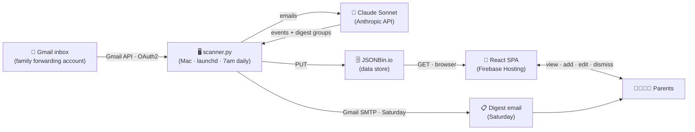

# Family Inbox Intelligence

A private family dashboard that reads a dedicated Gmail inbox where school and activity emails are forwarded. A Python scanner reads those emails, sends them to Claude, and extracts upcoming events and a weekly narrative digest. Results are stored in JSONBin and displayed in a React dashboard. Every Saturday morning a digest email is sent to both parents.

**Users:** Two parents and their children.
**Email sources:** All emails in the dedicated Gmail inbox are scanned. Family context configured via `FAMILY_CONTEXT` in `backend/.env`.

---

## Architecture



The scanner runs daily at 7am via Mac launchd. The frontend is a static SPA — no server required.

---

## Prerequisites

- Python 3.11+
- Node 18+
- Firebase CLI (`npm install -g firebase-tools`)
- A Google Cloud project with the **Gmail API** enabled and an OAuth 2.0 Desktop credentials file (`credentials.json`)
- Accounts on: Anthropic, JSONBin.io, Firebase (see [docs/SERVICES.md](docs/SERVICES.md))

---

## Backend setup

```bash
# 1. Create and activate virtualenv
python3 -m venv venv
source venv/bin/activate

# 2. Install dependencies
pip install -r backend/requirements.txt

# 3. Configure environment
cp backend/.env.example backend/.env
# Edit backend/.env — fill in all values (see .env.example for guidance)

# 4. Place Gmail OAuth credentials
# Copy credentials.json into backend/credentials.json
# (Download from Google Cloud Console → APIs & Services → Credentials)

# 5. Authenticate with Gmail (opens browser on first run)
cd backend
python scanner.py --test-auth
# Saves backend/token.json — subsequent runs skip the browser
```

---

## Frontend setup

```bash
cd frontend

# 1. Install dependencies
npm install

# 2. Configure environment
cp .env.example .env
# Edit frontend/.env — set VITE_JSONBIN_BIN_ID and VITE_JSONBIN_API_KEY
# NOTE: escape every $ in the API key with \$ (e.g. \$2a\$10\$...)

# 3. Run dev server
npm run dev
# Opens at http://localhost:5173
```

---

## Running the scanner

All commands run from the `backend/` directory with the virtualenv active.

```bash
# Full run: fetch emails → Claude → write JSONBin → send digest if Saturday
python scanner.py

# Dry run: all steps but no writes, prints JSON to console
python scanner.py --dry-run

# Force send the weekly digest email right now
python scanner.py --send-digest

# Smoke tests (run each independently to verify a step)
python scanner.py --test-auth
python scanner.py --test-fetch
python scanner.py --test-analyze
python scanner.py --test-jsonbin
```

---

## Deploying the frontend

```bash
# 1. Build
cd frontend && npm run build

# 2. Deploy (run from project root)
cd .. && firebase deploy --only hosting
```

Live URL is printed by Firebase CLI after deploy (`Hosting URL: https://...`).
The project ID is configured in `.firebaserc`.

Refreshing any path does not 404 — SPA rewrites are configured in `firebase.json`.

---

## Scheduler (Mac launchd)

The scanner runs automatically at 7am daily via a launchd plist.

**Plist location:** `~/Library/LaunchAgents/com.familyinbox.scanner.plist`
**Log file:** `~/Desktop/family-inbox/scanner.log`

```bash
# Load and start the scheduler
launchctl load ~/Library/LaunchAgents/com.familyinbox.scanner.plist
launchctl start com.familyinbox.scanner

# Verify it is registered
launchctl list | grep familyinbox

# Unload (stops automatic runs)
launchctl unload ~/Library/LaunchAgents/com.familyinbox.scanner.plist
```

**Required macOS permission:** System Settings → Privacy & Security → Full Disk Access → add `venv/bin/python3`. Without this the launchd job silently fails.

---

## Environment variables

### `backend/.env`

| Variable | Description |
|---|---|
| `ANTHROPIC_API_KEY` | Anthropic API key |
| `FAMILY_INBOX_EMAIL` | Gmail address of the family forwarding inbox |
| `GMAIL_APP_PASSWORD` | Gmail App Password for SMTP sending |
| `JSONBIN_BIN_ID` | JSONBin bin ID |
| `JSONBIN_API_KEY` | JSONBin master key |
| `DIGEST_RECIPIENTS` | Comma-separated list of digest email recipients |
| `LINEAR_API_KEY` | Linear API key (only needed for `linear_setup.py`) |
| `LINEAR_TEAM_ID` | Linear team key, e.g. `FAM` |

### `frontend/.env`

| Variable | Description |
|---|---|
| `VITE_JSONBIN_BIN_ID` | Same bin ID as backend |
| `VITE_JSONBIN_API_KEY` | Same master key as backend — escape `$` as `\$` |

---

## Folder structure

```
family_inbox_digest/
├── backend/
│   ├── scanner.py          # Main script: fetch → analyze → store → email
│   ├── config.py           # All user-configurable settings
│   ├── linear_setup.py     # One-time Linear ticket creator (not part of normal flow)
│   ├── requirements.txt
│   ├── credentials.json    # Gmail OAuth app credentials (do not commit)
│   ├── token.json          # Gmail OAuth user token (do not commit, generated on first auth)
│   ├── .env                # Secrets (do not commit)
│   └── .env.example
├── frontend/
│   ├── src/
│   │   ├── App.jsx
│   │   ├── api.js          # All JSONBin read/write functions
│   │   ├── index.css       # Design system (CSS variables, typography, layout)
│   │   └── components/
│   │       ├── EventCard.jsx
│   │       ├── AddEventForm.jsx
│   │       ├── DigestGroup.jsx
│   │       ├── StatsBar.jsx
│   │       └── FilterPills.jsx
│   ├── .env
│   └── .env.example
├── docs/
│   ├── SERVICES.md         # All external services and cancellation info
│   └── CLAUDE.md           # Codebase guide for AI-assisted development
├── firebase.json
└── .firebaserc
```