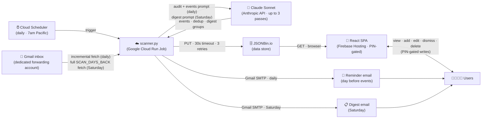

# Family Inbox Intelligence

> An LLM-powered family dashboard that extracts deadlines and events from school and activity emails — and keeps both parents in sync.


Family inboxes are full of emails that matter. Registration deadlines, picture day instructions, permission slips — they arrive mixed in with newsletters and reminders, easy to skim past and hard to act on. The expectation is that parents read everything carefully, every day. Nobody does that.

**Family Inbox Intelligence solves this two ways:**

**Shared event dashboard** — Upcoming deadlines, registrations, and events are extracted from incoming emails and surfaced on a shared dashboard. Both parents see it, either can mark items done or add their own, and a reminder fires the day before. No more *"I thought you saw that email."*

**Weekly family digest** — Every Saturday, a plain-language summary of what's actually been happening: what the class is learning, what went on at practice, the context you'd want but would never catch from subject lines alone.

**The approach:** Rather than writing brittle parsers for structured fields, the app passes raw email text directly to an LLM. This handles any sender, any format, any phrasing — and understands context that regex never could.


## Try the demo

**[family-inbox-intelligence-demo.web.app](https://family-inbox-intelligence-demo.web.app)** — read-only, anonymized sample data, no sign-in required.

---

## What it does

| | |
|---|---|
| **Daily scan** | Reads new emails incrementally — only emails since the last run, with a 1-hour overlap buffer to avoid gaps |
| **Claude extraction** | Up to 3 Claude passes: extract events, deduplicate across emails, generate the Saturday narrative digest |
| **Shared dashboard** | Either parent can add events, mark things done, or delete — changes are immediately visible to the other. One parent handling something actually registers for both. |
| **Day-before reminders** | Automatic email the day before any upcoming event |
| **Saturday digest** | Weekly narrative summary grouped by category, sent by email and shown on the dashboard |
| **Tombstone dedup** | Dismissed and deleted events are kept in storage so Claude never re-extracts them from the same email |

---

## Architecture



### Why this stack?

| Tool | Why |
|---|---|
| **Gmail API + OAuth2** | Reliable, official access to a Gmail inbox. OAuth2 tokens refresh automatically — no stored passwords. |
| **Claude (Anthropic API)** | Handles unstructured email text without brittle parsing rules. Works across any sender, format, or phrasing. |
| **JSONBin.io** | Zero-infrastructure data layer — a single JSON blob over a REST API. No database to provision or maintain. Free tier is sufficient. |
| **Google Cloud Run Job** | Serverless, scales to zero between runs. Costs pennies per month for a once-daily job. |
| **Firebase Hosting** | Free static hosting with CDN and SPA rewrite rules. Deploys in one command. |

**Estimated running cost:** roughly $0.50–$2/month depending on email volume (dominated by Claude API usage at ~$3/MTok input). JSONBin, Firebase Hosting, and Cloud Run all have free tiers that cover typical usage.

---

## Adapting for your own use case

This project is built around a family inbox but the architecture is general — it works for any email digest use case (a work inbox, a newsletter aggregator, a real estate alert digest, etc.).

The things to change:

1. **`FAMILY_CONTEXT` in `backend/.env`** — this string is injected directly into Claude's system prompt on every run. It tells Claude what kind of inbox this is, who the senders are, and any domain knowledge it needs to categorise and interpret emails correctly. Replace it with a description of your own inbox. Example for a work inbox: `"This is a project inbox for a small software consultancy. Senders include clients, contractors, and internal team members. Emails relate to project deadlines, invoices, meeting requests, and support tickets."`

2. **Categories in `backend/config.py`** — the `CATEGORIES` dict defines the event categories, their colours, and icons. Replace the six family categories with whatever makes sense for your domain. The same keys are used in the backend (email HTML) and frontend (cards, filter pills).

3. **Claude prompts in `backend/scanner.py`** — `_SYSTEM_PROMPT`, `_USER_PROMPT_TEMPLATE`, and `_DIGEST_PROMPT_TEMPLATE` contain family-specific framing. For a significantly different use case, review and update the language, the field descriptions, and the example values in the prompts.

4. **`DIGEST_RECIPIENTS` in `backend/.env`** — comma-separated list of email addresses that receive the Saturday digest and day-before reminders.

Everything else (the data shape, the dedup logic, the dashboard, the email templates) works without modification.

---

## Prerequisites

- Python 3.11+
- Node.js 18+
- Firebase CLI (`npm install -g firebase-tools`)
- gcloud CLI (`brew install --cask google-cloud-sdk` on Mac)
- A Google Cloud project with the **Gmail API** enabled and an OAuth 2.0 Desktop credentials file (`credentials.json`)
- Accounts on: Anthropic, JSONBin.io, Firebase, Google Cloud

> **Note:** `docs/SERVICES.md` referenced in this repo is gitignored — it contains private account IDs and URLs. You will need to create your own as you set up each service.

---

## Backend setup

```bash
# 1. Create and activate virtualenv
python3 -m venv venv
source venv/bin/activate

# 2. Install dependencies
pip install -r backend/requirements.txt

# 3. Configure environment
cp backend/.env.example backend/.env
# Edit backend/.env — fill in all values (see .env.example for guidance)

# 4. Place Gmail OAuth credentials
# Copy credentials.json into backend/credentials.json
# (Download from Google Cloud Console → APIs & Services → Credentials)

# 5. Authenticate with Gmail (opens browser on first run)
cd backend
python scanner.py --test-auth
# Saves backend/token.json — subsequent runs skip the browser
```

---

## Frontend setup

```bash
cd frontend

# 1. Install dependencies
npm install

# 2. Configure environment
cp .env.example .env
# Edit frontend/.env — set VITE_JSONBIN_BIN_ID, VITE_JSONBIN_API_KEY, and VITE_PIN_HASH
# NOTE: escape every $ in the API key with \$ (e.g. \$2a\$10\$...)
# NOTE: VITE_PIN_HASH is the SHA-256 hex hash of your PIN, not the raw PIN

# 3. Run dev server
npm run dev
# Opens at http://localhost:5173
```

---

## Running the scanner locally

All commands run from the `backend/` directory with the virtualenv active.

```bash
# Full run: fetch emails → Claude → write JSONBin → send reminder → send digest if Saturday
python scanner.py

# Dry run: all steps but no writes, prints JSON to console
python scanner.py --dry-run

# Force send the weekly digest email right now
python scanner.py --send-digest

# Force send the day-before reminder email right now
python scanner.py --send-reminder

# Override the fetch window for this run only (default: SCAN_DAYS_BACK from config)
python scanner.py --days 14

# Smoke tests (run each independently to verify a step)
python scanner.py --test-auth
python scanner.py --test-fetch
python scanner.py --test-analyze
python scanner.py --test-jsonbin
python scanner.py --test-dedup
python scanner.py --test-reminder

# Maintenance
python scanner.py --reset-last-scanned        # Clear lastScanned so next run fetches SCAN_DAYS_BACK days
python scanner.py --wipe-and-rescan           # Clear all JSONBin data then run a fresh scan
python scanner.py --wipe-and-rescan --days 14 # Same but fetch 14 days
```

---

## Deploying the frontend

Two Firebase Hosting sites are configured: `prod` (private dashboard) and `demo` (public read-only).

```bash
# Deploy production
cd frontend && npm run build
cd .. && firebase deploy --only hosting:prod

# Deploy demo
cd frontend && npm run build:mock
cd .. && firebase deploy --only hosting:demo

# Deploy both at once
cd frontend && npm run build && npm run build:mock
cd .. && firebase deploy --only hosting
```

Live URLs are printed by Firebase CLI after deploy.
SPA rewrites are configured in `firebase.json` — refreshing any path does not 404.

---

## Cloud Run (production scheduler)

The scanner runs in production as a Google Cloud Run Job triggered daily at 7am Pacific by Cloud Scheduler. Secrets (API keys, Gmail token) are stored in GCP Secret Manager and injected at runtime — nothing sensitive is baked into the container image.

Key files:
- `backend/Dockerfile` — container definition (Python 3.11-slim, installs requirements, copies scanner)
- `backend/entrypoint.sh` — copies the read-only Gmail token secret to a writable path, then runs scanner.py
- `backend/.dockerignore` — excludes `.env`, `credentials.json`, `token.json`, and `venv/` from the image

**Manually trigger a run:**
```bash
gcloud run jobs execute family-inbox-scanner --region=us-west1 --wait
```

**Update the container after changing scanner.py:**
```bash
cd backend
gcloud builds submit . \
  --tag="us-west1-docker.pkg.dev/YOUR_PROJECT_ID/family-inbox/scanner:latest"
gcloud run jobs update family-inbox-scanner \
  --image="us-west1-docker.pkg.dev/YOUR_PROJECT_ID/family-inbox/scanner:latest" \
  --region=us-west1
```

**If token.json needs regeneration** (e.g. refresh token revoked):
```bash
cd backend && source venv/bin/activate
python scanner.py --test-auth
gcloud secrets versions add GMAIL_TOKEN_JSON --data-file=token.json
```

---

## Environment variables

### `backend/.env`

| Variable | Description |
|---|---|
| `ANTHROPIC_API_KEY` | Anthropic API key |
| `FAMILY_INBOX_EMAIL` | Gmail address of the dedicated forwarding inbox |
| `GMAIL_APP_PASSWORD` | Gmail App Password for SMTP sending |
| `JSONBIN_BIN_ID` | JSONBin bin ID |
| `JSONBIN_API_KEY` | JSONBin master key |
| `DIGEST_RECIPIENTS` | Comma-separated list of email addresses that receive the digest and reminders |
| `FAMILY_CONTEXT` | Free-text description of the inbox and its senders, injected into Claude's system prompt on every run. This is the primary customization point — tell Claude what kind of inbox this is, who sends emails, and any domain knowledge it needs to interpret them correctly. |

### `frontend/.env`

| Variable | Description |
|---|---|
| `VITE_JSONBIN_BIN_ID` | Same bin ID as backend |
| `VITE_JSONBIN_API_KEY` | Same master key as backend — escape `$` as `\$` (Vite runs dotenv-expand) |
| `VITE_PIN_HASH` | SHA-256 hex hash of the PIN required to make any write action on the dashboard |

In production, all backend variables are stored in GCP Secret Manager and injected into the Cloud Run Job at runtime. The `.env` file is only used for local development.

---

## Folder structure

```
family_inbox_digest/
├── backend/
│   ├── scanner.py          # Main script: fetch → analyze → store → email
│   ├── config.py           # Categories, colours, icons, and scanner settings
│   ├── Dockerfile          # Cloud Run container definition
│   ├── entrypoint.sh       # Container startup: writes token.json, runs scanner.py
│   ├── requirements.txt
│   ├── .dockerignore
│   ├── credentials.json    # Gmail OAuth app credentials (do not commit)
│   ├── token.json          # Gmail OAuth user token (do not commit, generated on first auth)
│   ├── .env                # Secrets (do not commit)
│   └── .env.example
├── frontend/
│   ├── src/
│   │   ├── App.jsx
│   │   ├── api.js          # All JSONBin read/write functions
│   │   ├── index.css       # Design system (CSS variables, typography, layout)
│   │   └── components/
│   │       ├── EventCard.jsx
│   │       ├── AddEventForm.jsx
│   │       ├── DigestGroup.jsx
│   │       └── FilterPills.jsx
│   ├── .env
│   └── .env.example
├── docs/
│   ├── SERVICES.md         # All external services and account details (do not commit)
│   └── CLAUDE.md           # Codebase guide for AI-assisted development
├── firebase.json
└── .firebaserc
```
