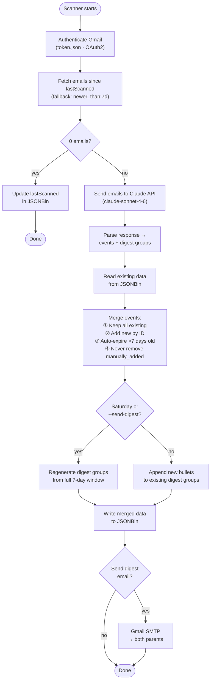

# Codebase Guide for AI-Assisted Development

This file gives an AI assistant the context needed to work on this project without re-reading the full conversation history.

---

## What this project does

Family Inbox Intelligence is a private family dashboard. A dedicated Gmail account (configured via `FAMILY_INBOX_EMAIL`) receives forwarded emails from schools and children's activity providers. A Python scanner reads those emails daily, sends them to Claude, and extracts:
- **Events:** upcoming dates, deadlines, and action items
- **Digest groups:** a weekly narrative summary grouped by sender

Results are stored in JSONBin.io. A React SPA reads JSONBin and displays everything. Both parents can view, add, edit, and dismiss events from their phones. Every Saturday a digest email is sent to both parents via Gmail SMTP.

**Email sources:** Configured via `FAMILY_CONTEXT` and `ALLOWED_FORWARDERS` in `backend/.env`.

---

## Scanner flow



---

## Stack

| Layer | Technology |
|---|---|
| Backend language | Python 3.11+ |
| Email reading | Gmail API (OAuth2 via `google-auth-oauthlib`) |
| AI analysis | Anthropic Python SDK — model `claude-sonnet-4-6` |
| Data store | JSONBin.io REST API (no database, no server) |
| Digest email | Gmail SMTP via `smtplib` + App Password |
| Scheduler | Mac launchd (daily 7am) |
| Frontend | React 19 + Vite 8 |
| Frontend hosting | Firebase Hosting (static SPA) |
| Project management | Linear (team key: FAM) |

---

## Key files

### Backend

| File | Purpose |
|---|---|
| `backend/scanner.py` | Main entrypoint. Orchestrates all steps: auth → fetch → analyze → merge → write → email |
| `backend/config.py` | All user-configurable settings and category metadata. Loaded from `backend/.env`. |
| `backend/credentials.json` | Gmail OAuth2 app credentials (do not commit, do not modify) |
| `backend/token.json` | Gmail OAuth2 user token (generated on first `--test-auth` run, do not commit) |
| `backend/.env` | All secrets (do not commit) |
| `backend/.env.example` | Template with all required variable names |
| `backend/requirements.txt` | Python dependencies |
| `backend/linear_setup.py` | One-time script that created all Linear tickets. Not part of normal operation. |

### Frontend

| File | Purpose |
|---|---|
| `frontend/src/api.js` | All JSONBin read/write — `loadData`, `saveData`, `dismissEvent`, `deleteEvent`, `addEvent`, `updateEvent` |
| `frontend/src/App.jsx` | Root component. All state, all handlers, top-level layout. |
| `frontend/src/index.css` | Design system: CSS variables, typography, layout, animations, skeleton loader |
| `frontend/src/components/EventCard.jsx` | Single event card with display + inline edit mode |
| `frontend/src/components/AddEventForm.jsx` | Modal / bottom-sheet form for manually adding events |
| `frontend/src/components/DigestGroup.jsx` | Collapsible card showing weekly narrative bullets per sender |
| `frontend/src/components/StatsBar.jsx` | Three stat cards: Upcoming / Urgent ≤3d / This Week |
| `frontend/src/components/FilterPills.jsx` | Category filter buttons (all / school / daycare / soccer / GFT / activities) |

---

## Data shape (JSONBin record)

```json
{
  "lastScanned": "2026-04-18T07:00:00Z",
  "events": [
    {
      "id": "evt_001",
      "title": "Picture Day",
      "date": "2026-04-25",
      "category": "school",
      "priority": "high",
      "source": "Springfield Elementary",
      "notes": "Wear class colour — blue for Grade 3",
      "dismissed": false,
      "manually_added": false
    }
  ],
  "digestGroups": [
    {
      "source": "Springfield Elementary",
      "category": "school",
      "week_of": "2026-04-14",
      "bullets": ["The class finished their weather unit and began ecosystems."]
    }
  ]
}
```

**Merge rules (applied on every scanner run):**
- Events: keep all existing where `dismissed=true` OR `manually_added=true`. Add new Claude events only if their `id` doesn't already exist.
- DigestGroups: always replace entirely with new Claude output.
- `lastScanned`: always update to current UTC timestamp.

---

## Scanner CLI flags

```bash
python scanner.py                # Normal run
python scanner.py --dry-run      # All steps, no writes, prints JSON to console
python scanner.py --send-digest  # Force send Saturday digest email regardless of day
python scanner.py --test-auth    # Test Gmail OAuth only
python scanner.py --test-fetch   # Test email fetching only
python scanner.py --test-analyze # Test Claude analysis only (uses cached fetch)
python scanner.py --test-jsonbin # Test JSONBin read/write only
```

---

## Category metadata

Defined in `config.py`. The same keys are used in both backend (email body) and frontend (colors, icons).

| Key | Icon | Color |
|---|---|---|
| `school` | 🏫 | `#60a5fa` |
| `daycare` | 🌻 | `#4ade80` |
| `scouts` | 🎯 | `#f87171` |
| `soccer` | ⚽ | `#f0c040` |
| `GFT` | 🥋 | `#c084fc` |
| `other` | 📬 | `#9090a8` |

---

## Design system (CSS variables)

```
--bg: #0c0c12          Dark background
--surface: #14141c     Header / elevated surfaces
--card: #1a1a24        Card backgrounds
--border: #26263a      Borders and dividers
--accent: #f0c040      Primary action color (yellow)
--text: #eaeaf4        Primary text
--sub: #9090a8         Secondary text / bullet markers
--muted: #55556a       Placeholder / label text
--green: #4ade80
--red: #f87171
--orange: #fb923c
--blue: #60a5fa
--purple: #c084fc
```

Fonts: DM Sans (400/600/700) for UI, DM Mono (500) for numbers. Loaded from Google Fonts CDN.
Mobile-first. All interactive elements min 44px touch target height.

---

## Environment variables

### `backend/.env`

| Variable | Description |
|---|---|
| `ANTHROPIC_API_KEY` | Anthropic API key |
| `FAMILY_INBOX_EMAIL` | Gmail address of the dedicated family forwarding inbox |
| `GMAIL_APP_PASSWORD` | Gmail App Password for SMTP sending |
| `JSONBIN_BIN_ID` | JSONBin bin ID |
| `JSONBIN_API_KEY` | JSONBin master key (literal `$` signs — Python dotenv reads fine) |
| `DIGEST_RECIPIENTS` | Comma-separated parent email addresses for Saturday digest |
| `ALLOWED_FORWARDERS` | Comma-separated parent Gmail addresses that forward school emails |
| `FAMILY_CONTEXT` | Free-text description of children's schools/providers passed to Claude |
| `LINEAR_API_KEY` | Linear API key (only used by `linear_setup.py`) |
| `LINEAR_TEAM_ID` | Linear team key, e.g. `FAM` |

### `frontend/.env`

| Variable | Description |
|---|---|
| `VITE_JSONBIN_BIN_ID` | Same bin ID as backend |
| `VITE_JSONBIN_API_KEY` | Same key as backend — escape every `$` as `\$` (Vite runs dotenv-expand) |

All actual values live in the `.env` files (gitignored). See `docs/SERVICES.md` for account details and infrastructure IDs.

---

## Infrastructure

All account details, project IDs, and live URLs are documented in `docs/SERVICES.md` (gitignored — contains private info).

Key paths on the local machine:
- launchd plist: `~/Library/LaunchAgents/com.familyinbox.scanner.plist`
- Scanner log: `~/Desktop/family-inbox/scanner.log`
- Firebase project: configured in `.firebaserc`

---

## Development conventions

- No stubs, no TODOs in shipped code. Every function is complete.
- Every secret lives in `.env`. Nothing hardcoded.
- Backend errors are logged with `logging` and raised explicitly — no silent failures.
- Frontend errors are caught by `api.js` functions and thrown as descriptive strings for the UI to display.
- The frontend reads/writes JSONBin directly from the browser — there is no backend API server.
- `firebase deploy --only hosting` is the only deploy step. No CI/CD pipeline.